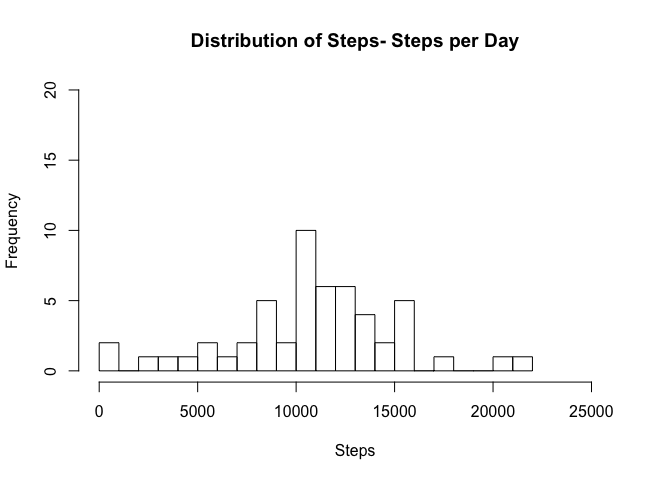
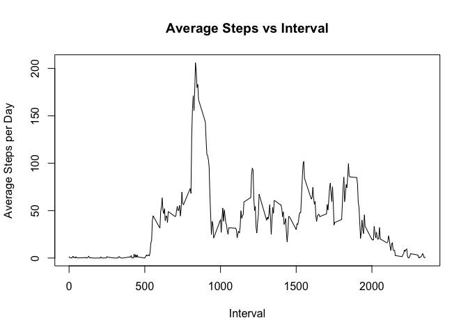
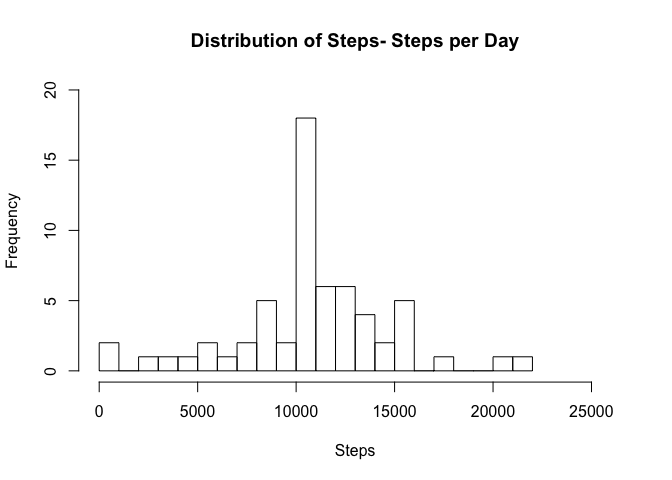
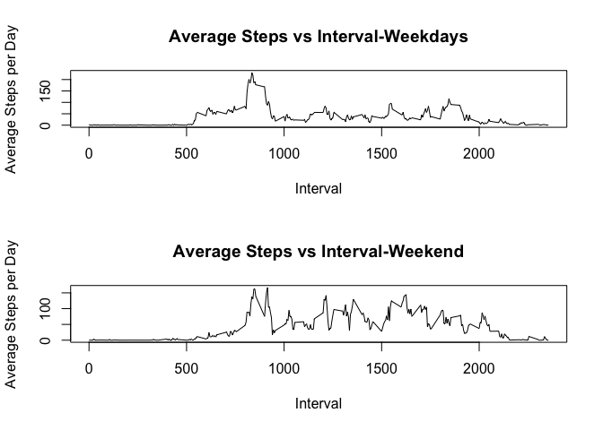

# Reproducible Research: Peer Assessment 1


## Loading and preprocessing the data
This assignment makes use of data from a personal activity monitoring device. This device collects data at 5 minute intervals   through out the day. The data consists of two months of data from an anonymous individual collected during the months of October and November, 2012 and include the number of steps taken in 5 minute intervals each day.

The data is downloaded from " https://d396qusza40orc.cloudfront.net/repdata%2Fdata%2Factivity.zip".On Jan 10,2017.

The dataset was downloaded as a table.


```r
library(dplyr)
library(ggplot2)
d = read.table(file="activity.csv", header=TRUE,sep=",",col.names=c("steps", "date","interval"))
dt=tbl_df(d)
```

Calculate the  number of readings that have incomplete data. Incomplete means that the steps variable take the value NA.

```r
sna1<-sum(is.na(dt$steps))
print(sna1)
```

```
## [1] 2304
```

The total  number of readings over the 2 month period.

```r
print(dim(dt)[1])
```

```
## [1] 17568
```
There are a relatively small numbers of incomplete readings.

Imputing missing values should be reasonable.

To compare a with a dataset which uses an algoritm to populate missing variables; calculate
summary statistics for a dataset where the incompl;ete readings are removed


```r
d_before_clean=filter(dt, !is.na(dt$steps))
d_before_cleang<-group_by(d_before_clean,date)
d_before_cleangS<-summarise(d_before_cleang,sum(steps))
colnames(d_before_cleangS)[2] <- "sumsteps"
print("Summary of Steps by Day distribution- before data cleaning with NA removal")
```

```
## [1] "Summary of Steps by Day distribution- before data cleaning with NA removal"
```

```r
print( summary(d_before_cleangS$sumsteps))
```

```
##    Min. 1st Qu.  Median    Mean 3rd Qu.    Max. 
##      41    8841   10760   10770   13290   21190
```


## What is mean total number of steps taken per day?
For this calaculation the  missing values in the dataset will be ignored.
First create a table with the number of steps per day over the time range of the input data.


```r
d_before_clean=filter(dt, !is.na(dt$steps))
d_before_cleang<-group_by(d_before_clean,date)
dcleang1<-summarise(d_before_cleang,sum(steps))
colnames(dcleang1)[2] <- "sumsteps"
hist(dcleang1$sumsteps,breaks=30,xlim= c(0,26000),ylim=c(0,20),main="Distribution of Steps- Steps per Day",xlab="Steps")
```

<!-- -->

Calculate the median and the mean of the "steps per day" distribution.


```r
print( summary(dcleang1$sumsteps))
```

```
##    Min. 1st Qu.  Median    Mean 3rd Qu.    Max. 
##      41    8841   10760   10770   13290   21190
```


## What is the average daily activity pattern?

Below is  a time series of the 5-minute interval (x-axis) and the average number of steps taken, averaged across all days (y-axis).


```r
d_before_clean=filter(dt, !is.na(dt$steps))
# prepare time series plot of Average Steps vs 5 min Interval
d_before_clean_g<-group_by(d_before_clean,interval)
d_before_clean_sum_ival<-summarise(d_before_clean_g,mean(steps))
colnames(d_before_clean_sum_ival)[2] <- "meansteps"
plot(d_before_clean_sum_ival$interval,d_before_clean_sum_ival$meansteps,type="l",main="Average Steps vs Interval",xlab="Interval",ylab="Average Steps per Day")
```

<!-- -->

The  5-minute interval, on average across all the days in the dataset, which contains the maximum number of steps
is displayed below:


```r
# 5 min interval with largest number of average steps
largest<-max(d_before_clean_sum_ival$meansteps)
maxInterval<-filter(d_before_clean_sum_ival,meansteps == largest)
print(maxInterval$interval)
```

```
## [1] 835
```


## Imputing missing values
Imputed values will be calculated and the data will be modified with those imputed values
before any futher data analysis is done. The strategy for filling missing data is to
replace NAs with the mean for that 5-minute interval accross all days in the dataset.
The 5 min means are calculated with incomplete data removed.

In addition,date fields are modified to R Date format in this code.

Following is the code for the data processing. 


```r
# calculate interval means
dr<-filter(dt,!is.na(steps))
dr<-group_by(dr,interval)
interval_means<-summarise(dr,mean(steps))
colnames(interval_means)[2] <- "interval_meansteps"
imputed<-mutate(interval_means, meansteps_int = as.integer(interval_meansteps))
imputed1<-select(imputed,interval,meansteps_int)
# add colunm with interval means
djoined<-left_join(dt,imputed1,by='interval')
# process imputed data
# clean data by replacing NAs with global average (integer) for that interval
dclean<-mutate(djoined,steps=replace(steps, is.na(steps),meansteps_int ))
# transform the dates to date format
dclean$date<-as.character(dclean$date)
dclean$date<-as.Date(dclean$date,format = "%Y-%m-%d")
```

Create a table with the number of steps per day over the time range of the input data using
the dataset with imputed values.Draw a histogram of the distribution for the new dataset.


```r
d_cleang<-group_by(dclean,date)
dcleang1<-summarise(d_cleang,sum(steps))
colnames(dcleang1)[2] <- "sumsteps"
hist(dcleang1$sumsteps,breaks=30,xlim= c(0,26000),ylim=c(0,20),main="Distribution of Steps- Steps per Day",xlab="Steps")
```

<!-- -->


Calculate the median and the mean of the "steps per day" distribution when the imputed data was added.
The median dropped when the imputed data was added, although the change was relatively small.


```r
print( summary(dcleang1$sumsteps))
```

```
##    Min. 1st Qu.  Median    Mean 3rd Qu.    Max. 
##      41    9819   10640   10750   12810   21190
```


## Are there differences in activity patterns between weekdays and weekends?

A panel plot is created containing a time series  of the 5-minute interval (x-axis) and the average number of steps taken, averaged across all weekday days or weekend days (y-axis).

The plots show that although the peek steps are greater on week days,the average number of
daily steps is greater on the weekend.


```r
# add factor variable for weekday/wwekend
dcleanDayT<-mutate(dclean,weekday=weekdays(date))
# create tables for weekday and weekend
week_end=c("Saturday","Sunday")
week_day=c("Monday","Tuesday","Wednesday","Thursday","Friday")
dcleanWd<-mutate(dcleanDayT,weekday=replace(weekday,weekday%in%week_day,"Weekday"))
dcleanWd1<-mutate(dcleanWd,weekday=replace(weekday,weekday%in%week_end,"Weekend"))
dclean_weekend<-filter(dcleanWd1,weekday=="Weekend")
dclean_weekday<-filter(dcleanWd1,weekday=="Weekday")

# create summary frames for weekday and weekend
dclean_weekendG<-group_by(dclean_weekend,interval)
dclean_weekdayG<-group_by(dclean_weekday,interval)

weekday_interval_means<-summarise(dclean_weekdayG,mean(steps))
colnames(weekday_interval_means)[2] <- "interval_meansteps"

weekend_interval_means<-summarise(dclean_weekendG,mean(steps))
colnames(weekend_interval_means)[2] <- "interval_meansteps"

#plot the line graphs
par(mfrow = c(2,1))
plot(weekday_interval_means$interval,weekday_interval_means$interval_meansteps,type="l",
     main="Average Steps vs Interval-Weekdays",xlab="Interval",ylab="Average Steps per Day")
plot(weekend_interval_means$interval,weekend_interval_means$interval_meansteps,type="l",
     main="Average Steps vs Interval-Weekend",xlab="Interval",ylab="Average Steps per Day")
```

<!-- -->

